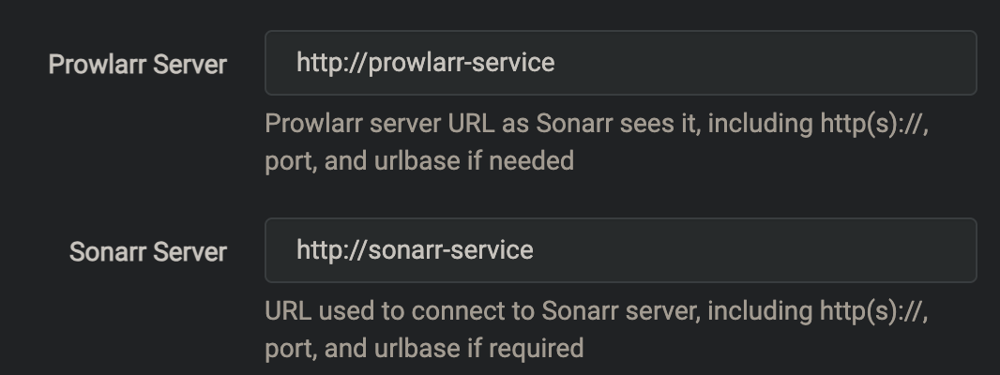

# Right, what's all this then?
Burglarr is an implementation of my favorite tools to manage my media collection, made into an overcomplicated Kubernetes deployment so I could play with the technology. Notably, I created this with the goal of learning the Kubernetes framework, including services, networking, storage and deployment. I have tried to build/write this to be shareable, but the primary goal is to run _my_ Burglarr instance, so you may find some dependencies aren't outlined in documentation

Burglarr is broken down into 3 deployments, which create the following 8 pods:


- Media Distribution: [Plex media server](https://www.plex.tv/media-server-downloads/)
  - The HAMMER bootstrap script to optimize it for anime handling
  - I am temporarily out-scoping this; the Plex app has become unusable (eying Jellyfin) and the server needs _power_
- Media Managers: [The "arr" stack](https://wiki.servarr.com/) with Deluge and [Overseerr](https://overseerr.dev/)
  - [Sonarr - TV](https://wiki.servarr.com/sonarr)
  - [Radar - Movies](https://wiki.servarr.com/radarr)
  - [Lidar - Music](https://wiki.servarr.com/lidarr)
  - ~~[Readarr - Books](https://wiki.servarr.com/readarr)~~ Cancelled
  - ~~[Whisparr - XXX](https://wiki.servarr.com/whisparr)~~ My family sees this 🤦
  - [Prowlarr - Indexer](https://wiki.servarr.com/prowlarr)
  - [Ombi - Requests](https://docs.ombi.app/)
  - [Deluge - Data transfer](https://docs.linuxserver.io/images/docker-deluge/#version-tags)*
- [NGINX](https://nginx.org/en/docs/), in 3 configurations:
  - Edge load balancer, on my OPNsense firewall
  - Kubernetes ingress controller
  - Web site hosting

Each of these components will be built into a helm chart, and deployed using idempotent commands (possibly through a CICD pipeline 🤔)

# Deployment
Entrypoint for the deployment of the entire Burglarr stack. Read through this section sequentially, stop-and-fix problems.

If doing CICD deployment, please consider some cautionary points:
- I _strongly_ suggest writing your own deployment scripts for your lifecycles
  - I set `export KUBECONFIG=$HOME/.kube/config-bglr`
- I had to get creative with DNS, see below it's just for setup

The deployment happens in 3 phases.

1. Kubernetes
2. OOBE
3. Configuration

The **Kubernetes** involves deploying the cluster and associaetd resources. This is highly automated, and was the driving factor behind this project.

**OOBE** is mostly dealing with *arr specific things I could not automate; setting proxy base URLs. It's "10 minutes to do by hand, 10 weeks to automate".

**Configuration** is a mix of personalization, optimization and remaining config. It starts with (one thing) integrating the various services, then configuring profiles, integrations, etc.


## Cluster and supporting infra
Cluster creation/deployment is described in [Cluster-Deployment.md](/docs/Cluster-Deployment.md).

### Configure Config/Downloads Storage
The cluster will need Persistent Volumes, explained [here](https://github.com/benjaminpieplow/automation/blob/main/kubernetes/KUBERNETES.md#add-cluster-storage). Follow that verbatim, and the deployments _should_ auto provision persistent storage for all the services'. Each app needs a `/config` directory, and many use the `/downloads` mount. These are split into different manifests:

`deploy/infra/shared-storage.yaml` defines `downloads` and `media`, which should more-or-less lifecycle itself with the deployment (IE, if you nuke an app, they should persist). It _must_ be deployed before any apps will start:
```
kubectl apply -f ./deploy/infra/shared-storage.yaml
```
Kubernetes has the ability to "overdefine"; I could have added a `downloads` PV/PVC to each App manifest, but this comes with the trade-off that if you `kubectl delete` the app, the storage goes with it, which is "not very cash money" when run against your media collection.

`deploy/apps/*arr/*arr-storage.yaml` defines the Persistent Volume Claims for the apps' configuration. If an app has to be rebuilt (database corruption, forgot password) this can be included in the `kubectl delete`.

`deploy/apps/*arr/*arr-manifest.yaml` defines the Volumes for the app. If an app has to be redeployed (update, restart) a `kubectl delete` can be run against this manifest, without forcing a complete rebuild.

### Configure Media Storage
Your media library must also be shared configured in `/deploy/infra/storage.yaml` (will port to helm later). A user with UID=1000 must have full control of the media collection. The file structure must look like this:

```
media/
├─ ebooks/
├─ movies/
├─ music/
├─ tv/
```

Inside of that, the *arr service can _usually_ figure stuff out. Eventually, I will add support for more instances and expand `movies_4k` and `tv_fhd`; let's get it booting first.

To connect the *arr apps to your media collection, modify `/deploy/infra/storage.yaml` with your file server/share info. The `path` should line up with the base media folder (so, `/data/media/tv`, `path: /data/media`).


### Configure DNS
The *arr stack OOBEs very nicely, but it's [not possible](https://github.com/linuxserver/docker-sonarr/issues/118) to sideload reverse proxy configuration. This means it's impossible to configure the services if they're hidden behind a single-hostname proxy, so the initial setup _must_ be done by identifying the service in the FQDN, not URL (`sonar.foo.com` vs `foo.com/sonarr`). The easiest workaround I have found to this, is to give each service an Ingress of `*arr.burglarr.local`. These are baked into the deployment, as you will _probably_ have to tweak stuff "in the backend" every once in a while (read: reconfigure a service from scratch)

Ideally, set a wildcard `*.burglarr.local` pointing to any node on your K8s cluster in your DNS.

If using the Windows host file, you will need to manually set each one as [.hosts does not support wildcards](https://superuser.com/questions/135595/using-wildcards-in-names-in-windows-hosts-file):
- sonarr.burglarr.local
- radarr.burglarr.local

## Apps
Each of the apps can be deployed "in one go", but I recommend doing them one at a time so errors can be addressed before they're repeated.
```
kubectl apply -f ./deploy/apps/sonarr/
kubectl apply -f ./deploy/apps/radarr/
kubectl apply -f ./deploy/apps/lidarr/
kubectl apply -f ./deploy/apps/prowlarr/
kubectl apply -f ./deploy/apps/deluge/
kubectl apply -f ./deploy/apps/jellyfin/
```

### Sonarr
Once the app is online,
1. OOBE (popup auth recommended)
2. Note API Key
3. Settings > General > URL Base: `/sonarr`

### Radarr
Once the app is online,
1. OOBE (popup auth recommended)
2. Note API Key
3. Settings > General > URL Base: `/radarr`

### Lidarr
Once the app is online,
1. OOBE (popup auth recommended)
2. Note API Key
3. Settings > General > URL Base: `/lidarr`

### Deluge
Once the app is online,
1. OOBE (set password)
2. Install labels plugin

### Prowlarr
Once the app is online,
1. OOBE (popup auth recommended)
2. Note API Key
3. Settings > General > URL Base: `/prowlarr`
4. Link other services

When configuring links to other services, you can reference them by their K8s service name:




## Plex (legacy)
Plex will be by far the easiest, as they already provide a [Helm chart](https://github.com/plexinc/pms-docker/tree/master/charts/plex-media-server) which I can use. On the first deployment, you will need to generate your `plex_values.yaml`.

```
helm repo add plex https://raw.githubusercontent.com/plexinc/pms-docker/gh-pages

helm show values plex/plex-media-server > plex_values.yaml
```


# Components
An in-depth analysis of the configurations and tweaks made for the deployment.

## Plex
### Nodeport or ClusterIP

Solution: Use ClusterIP, expose as service

According to the `values.yaml`,
```
  type: ClusterIP
  port: 32400

  # Port to use when type of service is "NodePort" (32400 by default)
  # nodePort: 32400

  # when NodePort is used, plex is unable to determine user IP
  # all traffic seems to come from within the cluster
  # setting this to 'Local' will allow Plex to determine the actual IP of user.
  # used to determine bitrate for remote transcoding
  # but the pods can only be accessed by the Node IP where the pod is running
  # Read more here: https://kubernetes.io/docs/tasks/access-application-cluster/create-external-load-balancer/#preserving-the-client-source-ip
  # https://access.redhat.com/solutions/7028639
  # externalTrafficPolicy: Local
```

Consider that in our deployment, we will be using an edge load balancer which expects the Kubernetes cluster's ingress controller to present all services on one port:


When the LB edge proxy (OPNsense) processes the request, it will rebuild the HTTP header and thus the underlying IP header. As such, preserving the client IP will do us no good. OPNsense's NGINX sets [X-Forwarded-For](https://github.com/opnsense/plugins/blob/master/www/nginx/src/opnsense/service/templates/OPNsense/Nginx/location.conf#L167), however [plex ignores this](https://www.reddit.com/r/PleX/comments/edxkh0/plex_not_respecting_xforwardedfor_or_xrealip/) (or did 5 years ago). Furthermore, "used to determine bitrate for remote transcoding" is not a great sell; one of my biggest gripes with Plex was having to instruct my clients to manually select a higher bitrate, as Plex always chose Potato quality when enough bandwidth was available to skip transcoding altogether. I may fix this in a future release, for now, I couldn't care less.

## Deluge (legacy)
This might become [qBittorrent](https://github.com/linuxserver/docker-qbittorrent) as Deluge seems inactive, and I remember having to get creative with the Proxy forwarding to get the web UI working correctly. The client itself was wonderful, offering a fat client and some sneaky redirects so you could open torrent files locally and have them forwarded to the "server".